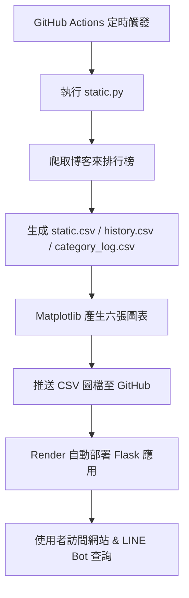

---

# 書籍熱度即時追蹤與 LINE 智慧推薦系統

## 一、專題背景

### 1. 動機

* 網路書店排行榜瞬息萬變，讀者難以即時掌握熱門書籍動態。
* LINE 使用者習慣以對話介面互動，若能結合自然語言查詢，將大幅提升使用者體驗。

### 2. 目標

* 自動爬取 **博客來** 每日書籍排行榜與分類統計，並進行儲存與可視化。
* 提供 **Web 介面與 LINE Bot**，讓使用者可透過表格或對話查詢與收藏書籍。

---

## 二、功能介紹

### 1. 爬蟲與自動排程

* 使用 **GitHub Actions** 每天自動執行 `static.py`。

### 2. 資料生成

* 產生三個主要資料表：

  * `static.csv`：當日 50 本書。
  * `history.csv`：保留近七天排行榜資料。
  * `category_log.csv`：每日分類統計 Top N。

### 3. 圖表可視化

共生成六張圖表：

1. 分類市占長條圖
2. 價格箱型圖
3. 價格散佈圖
4. 分類變化折線圖
5. 分類堆疊圖
6. 書名常駐排行榜圖

### 4. Flask 網站

* `/`：首頁，顯示上述六張圖表。
* `/static`：當日排行榜，提供分類下拉篩選功能，隱藏重複分類欄位。
* `/history`：歷史排行榜，分頁顯示過去七天每日排行榜（每頁 50 本書）。

### 5. LINE Bot 功能

* **聊天模式**：「聊天」→ AI 回應（Gemini）。
* **書籍查詢模式**：「書籍」→ 顯示指令列表。
* **熱門排行查詢**：「新書排行」「分類排行榜」「分類 XXX」→ 即時查詢。
* **收藏管理**：「收藏 書名」「刪除收藏 書名」「我的收藏」→ 管理使用者收藏。

---

## 三、技術架構

| 類別      | 技術/工具                                                 |
| ------- | ----------------------------------------------------- |
| 後端開發 | Python（Requests、Pandas、Matplotlib、Flask、line-bot-sdk） |
| 字型處理 | `NotoSansCJKtc-Regular.otf`（支援繁體中文）                   |
| 自動化  | GitHub Actions（每日排程執行）                                |
| 部署   | Render（使用 gunicorn + Procfile，自動部署與休眠喚醒）              |
| 資料格式 | CSV 為主，SQLite/JSON 可擴展收藏管理                            |

---

## 四、程式流程圖

---

## 五、成果展示

* **每日自動更新**：排行榜與圖表自動生成、推送至 GitHub。
* **視覺化分析**：六張高品質繁中圖表，快速掌握分類趨勢。
* **互動式體驗**：支援分類篩選、分頁切換、收藏功能。
* **多端整合**：網站與 LINE Bot 雙介面查詢。

---

## 六、個人貢獻

* 撰寫 `static.py`：負責爬蟲、CSV 生成、圖表產生與字型註冊。
* 設定 GitHub Actions Workflow（自動化排程）。
* Render 雲端部署與 Linux 環境中文字型修正。
* 開發 `app.py` 路由邏輯（分類篩選、歷史分頁）。
* 設計 `templates/*.html` 排版與分頁按鈕樣式。

---

## 七、問題與解決方案

| 問題                 | 解決方案                                                                                                |
| ------------------ | --------------------------------------------------------------------------------------------------- |
| Matplotlib 無法顯示中文字 | 將 `Noto Sans CJK TC` 字型放入專案中，並以 `font_manager.addfont()` 註冊。                                        |
| CSV 欄位中含逗號導致解析錯誤   | 使用 `quotechar='"'` 參數處理，例如 `pandas.read_csv(..., quotechar='"')`。                                   |
| 分頁排版跑版             | 在 CSS 中加上 `table-layout: fixed; word-break: break-all;` 並使用 `.table-wrapper { overflow-x: auto; }`。 |

---

## 八、心得與收穫

* **整合能力提升**：完整體驗從爬蟲 → 資料處理 → 視覺化 → Web → LINE Bot → 自動部署的全流程開發。
* **跨領域學習**：處理繁中字型、雲端部署等多項技術挑戰。
* **團隊協作**：明確分工與互相 code review，確保系統穩定。
* **未來展望**：計畫加入互動式圖表、AI 推薦演算法與個性化推薦功能。

---